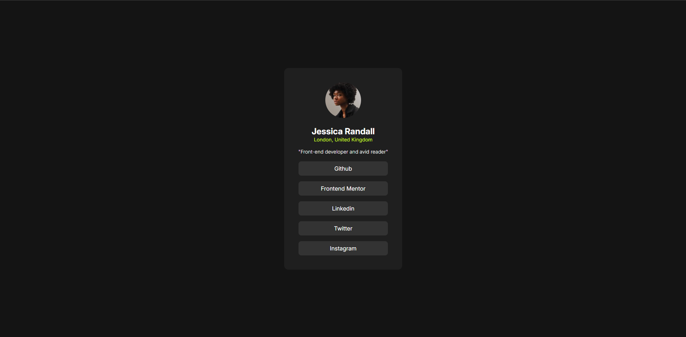

# 📱 Social Links Profile - Frontend Mentor

Esta é a minha solução para o desafio [Social links profile challenge do Frontend Mentor](https://www.frontendmentor.io/challenges/social-links-profile-UG32l9m6dQ).

## 🎯 O Desafio

O objetivo principal deste projeto foi construir um cartão de links sociais, o mais fiel possível ao design original, garantindo que o layout fosse totalmente responsivo e acessível para diferentes tamanhos de tela.

### 📸 Screenshot

### 🔗 Links

- [**Live Site (Deploy):**](https://thekingofpamonha.github.io/Social-Links-Profile/)
- [**Repositório:**](https://github.com/TheKingofPamonha/Social-Links-Profile)]

## 🛠️ Construído com

- **HTML5 Semântico:** Uso de marcações corretas para acessibilidade e estruturação lógica.
- **CSS Custom Properties:** Variáveis no `:root` para gerenciar e manter a paleta de cores.
- **CSS Flexbox:** Para o alinhamento do cartão principal e fluidez da lista de links.
- **Unidades Relativas (`rem`):** Substituição completa de `px` por `rem` para garantir escalabilidade e acessibilidade na tipografia e nos espaçamentos.
- **Git & VS Code:** Versionamento profissional e commits granulares direto pela ferramenta de Source Control do editor.

## 🧠 O que eu aprendi

Neste projeto, apliquei conceitos vitais para um código de front-end moderno, acessível e de fácil manutenção:

1. **Acessibilidade e Medidas Relativas:** Fiz a transição prática de pixels para `rem` (onde 1rem = 16px). Isso garante que o layout se adapte automaticamente e de forma harmônica caso o usuário aumente a fonte padrão do navegador.
2. **Centralização Moderna:** Abandonei o uso de margens engessadas e centralizei o conteúdo de forma responsiva utilizando o `body` como um container Flex (`min-height: 100vh`).
3. **Design Fluido:** Removi alturas fixas (`height`) da caixa principal e substituí larguras rígidas nos botões por `width: 100%`. Isso permite que o cartão se adapte perfeitamente em telas de dispositivos móveis sem quebrar o layout.
4. **Fluxo de Trabalho Profissional:** Estruturei o versionamento do projeto de forma atômica, criando "pacotes lógicos" com mensagens de commit verbais e claras.

## 🔜 Desenvolvimento Contínuo

Com base nos feedbacks de documentação e melhores práticas:
- [ ] Continuar aprimorando atributos de acessibilidade em componentes interativos.
- [ ] Manter o padrão de commits descritivos usando verbos no imperativo nos próximos projetos.

## 🙋‍♂️ Autor

- Frontend Mentor - [TheKingofPamonha](https://www.frontendmentor.io/profile/TheKingofPamonha)
- GitHub - [TheKingofPamonha](https://github.com/TheKingofPamonha)
- Linkedin - [Davi Luis](https://www.linkedin.com/in/davi-luis-andrade-da-silva-974439324/)
